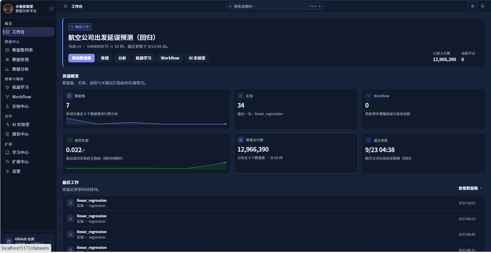

# 小洛实验室 (XiaoLuo Lab)

一个本地优先、可服务器部署，面向数据处理、数据分析、机器学习、大模型 Agent 与实验教学的智能数据科学实验平台。

> 中文名：小洛实验室；英文名：XiaoLuo Lab
> 项目代号：xiaoluo-lab
> 仓库地址：<https://github.com/xiaoluojiu/xiaoluo-lab>
> 面向场景：高校毕业设计 / 数据科学实验教学 / 本地化数据分析与建模

---



## 一、项目介绍1

小洛实验室是一个面向毕业设计与数据科学教学的一体化实验平台，目标是将「数据处理 → 数据探索 → 智能合并 → 机器建模 → Agent 智能分析 → 工作流编排 → 实验报告」整合到同一套体系中，并贯彻以下原则：

- **本地优先**：数据与实验产物（数据集版本、模型、报告）存储在本地文件系统与本地数据库，避免数据外流。
- **可服务器部署**：提供 Docker 化部署方案，支持多用户访问。
- **面向教学**：覆盖数据处理 / 分析 / 建模 / Agent 编排 / 工作流 / 实验对比的完整链路，支持中文实验报告自动生成（Markdown / HTML / PDF）。
- **AI 编排**：内置 Agent 系统（Context → Planner → Permission → Executor → Validator → Replanner），通过工具注册表与权限管理编排数据分析任务。
- **可复现**：所有数据操作产生不可变版本快照，所有实验绑定具体版本快照与随机种子。
- **安全可控**：Agent 无 shell/eval/exec 通道，所有工具调用经 TOOL_REGISTRY；存储层防路径穿越；按角色与风险等级授权。

### 核心特性

| 特性 | 说明 |
| --- | --- |
| 数据处理 | 支持 CSV / Excel / JSON / Parquet 加载；Filter / Clean / Transform / Aggregate / Pivot / Melt / Cast / String / Missing / Duplicate 9 类操作 |
| 数据集版本 | 每次修改产生新的 parquet 快照（不可变），版本号单调递增，全程审计 |
| 智能合并 | Schema 映射建议、Join Key 分析、MergePlan 计划与执行分离、合并前强制校验 |
| 探索性分析 (EDA) | 描述统计、分布分析、相关性分析、异常值检测、可视化 |
| 机器学习 | 11 个内置模型（分类 / 回归 / 聚类 / 降维），统一 ModelAdapter 接口，自动任务识别与模型选择，sklearn Pipeline 预处理（防数据泄漏） |
| Agent 系统 | 上下文感知、计划生成、权限裁决、工具执行、结果校验、失败重规划，带硬限制防无限循环 |
| 工作流 | DAG 工作流引擎，节点拓扑执行、失败传递跳过、可取消 |
| 实验 | 实验与数据版本绑定，支持训练运行、指标评估、模型对比、实验删除 |
| 报告 | 中文实验报告生成器（Markdown / HTML / PDF 渲染，PDF 字体路径可配置） |
| 安全 | 路径穿越防护、Prompt 注入防御、角色权限、风险等级确认、API Key 脱敏 |
| 部署 | Docker Compose 一键启动后端 + 前端，本地 volume 持久化 |

---

## 二、技术架构

```
┌──────────────────────────────────────────────────────────────┐
│  Frontend：React 18 + TypeScript + Vite + Zustand + React Router│
│  ── 路由 / API Client (axios) / 页面 / 功能组件 / 全局状态     │
└───────────────────────────┬──────────────────────────────────┘
                            │ HTTP (统一 /api/v1 前缀)
┌───────────────────────────┴──────────────────────────────────┐
│  Backend：FastAPI + Python 3.12 + Pydantic                     │
│  ── 统一异常 / 中间件 / 依赖注入 / 10 个 Router                │
│  ┌────────────┐  ┌────────────┐  ┌────────────┐  ┌──────────┐ │
│  │ DataEngine │  │  ML Engine │  │   Agent    │  │ Workflow │ │
│  │ Polars     │  │  scikit-   │  │  Context → │  │  DAG     │ │
│  │ PyArrow    │  │  learn     │  │  Planner → │  │  拓扑执行│ │
│  │ 9 操作     │  │  11 模型   │  │  Permission│  │          │ │
│  │ loaders.py │  │  评估/解释 │  │  Executor  │  │          │ │
│  └────────────┘  └────────────┘  └────────────┘  └──────────┘ │
│  ┌────────────┐  ┌──────────────────────────────────────────┐ │
│  │ analysis  │  │ Tool Registry（22 内置工具） / Permission  │ │
│  │ Profiling │  │   Manager（角色 + 风险等级授权）          │ │
│  │ Quality / │  └──────────────────────────────────────────┘ │
│  │ EDA 合并  │                                                   │
│  └────────────┘                                                   │
│  ┌────────────┐  ┌────────────┐  ┌────────────┐               │
│  │ Storage    │  │   DB       │  │  Reports / │               │
│  │ Local FS   │  │ SQLAlchemy │  │  Experiments│              │
│  │ 防穿越     │  │ + SQLite   │  │            │               │
│  └────────────┘  └────────────┘  └────────────┘               │
└──────────────────────────────────────────────────────────────┘
```

### 技术栈速览

| 层 | 技术 |
| --- | --- |
| 前端 | React 18 + TypeScript 5 + Vite 5 + Zustand + React Router 6 + axios |
| 后端 | FastAPI + Python 3.12 + Pydantic v2 + SQLAlchemy 2 + Alembic |
| 数据引擎 | Polars（Lazy Execution）+ PyArrow（列式零拷贝），单文件 loaders / operations |
| 机器学习 | scikit-learn（分类 / 回归 / 聚类 / PCA + Pipeline 预处理）+ SHAP（可选） |
| LLM | OpenAI Compatible（httpx 直连，不绑定厂商） |
| 数据库 | SQLite（默认）/ PostgreSQL（生产，仅改 `DATABASE_URL`） |
| 存储 | 本地文件系统（带路径穿越防护） |
| 测试 | pytest + pytest-asyncio + 共享 conftest.py |
| 代码规范 | ruff（line-length=100，target Python 3.11+） |
| 部署 | Docker + docker-compose |
| 本地意图路由（可选） | Qwen3-0.6B + LoRA（torch / transformers / peft，**可选依赖**） |

### 本地意图路由器（可选能力）

Agent 的第一层意图理解可以跑一个本地小模型（Qwen3-0.6B + LoRA），
**它只做意图识别与路由，不执行工具、不做复杂推理、不产出最终回答**：

```
用户 → L0 升级规则 → L1 Qwen 神经路由 →（未命中）L1 词法路由 → 反问规则
     → RouterDecision → Planner → Tool Registry → Permission → Executor
     → Validator / Replanner → 最终回答
```

- 三档开关 `LOCAL_ROUTER_MODE`：`off`（默认）/ `shadow`（只记录不改行为）/ `active`。
- 权重不随仓库分发，放在 `models/` 下即可，路径支持相对与绝对两种写法。
- 依赖是**可选的**：不装 torch 也能完整运行平台，本地路由自动退回词法模型 + 规则。
- 模型输出只经 `json.loads` 解析成既有 `RouterDecision`，随后走既有的
  Planner / Tool Registry / Permission 流程，不存在 `eval` / `exec` 执行路径。
- 加载失败、JSON 解析失败、推理超时、工具不在注册表、`dataset_id` 幻觉
  都有明确处置，不会出现空白回复或 SSE 挂死。

详见 [`backend/docs/LOCAL_ROUTER_QWEN.md`](backend/docs/LOCAL_ROUTER_QWEN.md)。

---

## 三、安装

### 3.1 前置要求

| 工具 | 最低版本 | 说明 |
| --- | --- | --- |
| Python | 3.11+（推荐 3.12） | 后端运行时 |
| Node.js | 18+（推荐 v24） | 前端构建 |
| npm | 与 Node 自带 | 前端依赖管理 |
| Git | 任意 | 克隆仓库 |
| Docker | 24+（可选） | 容器化部署 |
| Docker Compose | v2+（可选） | 编排 |

### 3.2 后端安装

```bash
cd backend

# 1. 创建虚拟环境（Windows: .venv\Scripts\activate；Linux/macOS: source .venv/bin/activate）
python -m venv .venv
.venv\Scripts\activate     # Windows
# source .venv/bin/activate  # Linux/macOS

# 2. 以可编辑模式安装（含开发依赖）
python -m pip install --upgrade pip
pip install -e ".[dev]"

# 3. 复制环境配置
copy ..\.env.example .env    # Windows
# cp ../.env.example .env     # Linux/macOS

# 4. 执行数据库迁移
python -m alembic upgrade head
```

环境变量在 `backend/.env` 中按需修改（API Key 必须通过环境变量或 .env 提供，禁止硬编码）：

```
APP_ENV=dev
DATABASE_URL=sqlite:///./data/xiaoluo.db
DATA_ROOT=./data
MODEL_ROOT=./models
LLM_PROVIDER=openai
LLM_API_KEY=            # 留空则使用规则规划器（无需 LLM 也可运行 Agent）
LLM_BASE_URL=https://api.openai.com/v1
LLM_MODEL=gpt-4o-mini
PDF_FONT_PATH=          # 可选：PDF 中文字体 .ttf 路径；也可用环境变量 XIAOLUO_PDF_FONT
```

### 3.3 前端安装

```bash
cd frontend
npm install --no-audit --no-fund
```

如需自定义后端地址，在 `frontend/.env.local` 中设置：

```
VITE_API_BASE_URL=http://localhost:8000
```

否则 vite 代理会以同源 `/api/v1` 转发到 `http://localhost:8000`。

---

## 四、启动应用

### 4.1 一键启动（推荐）

项目根目录提供 PowerShell / Bash 双版本脚本：

```powershell
# Windows PowerShell
pwsh scripts/dev_start.ps1
```

```bash
# Linux/macOS
bash scripts/dev_start.sh
```

脚本会自动：
1. 校验 Python / Node 版本
2. 后端：创建 / 复用 `.venv`、安装依赖、执行 alembic 迁移、后台启动 uvicorn（`--reload`）
3. 前端：`npm install`（首次）+ 后台启动 vite dev server
4. 打印访问地址，`Ctrl+C` 时自动清理子进程

启动后访问：

- 后端 API：<http://localhost:8000/api/v1/health>
- 前端 UI：<http://localhost:5173>

### 4.2 手动启动

后端：

```bash
cd backend
.venv\Scripts\activate
python -m uvicorn app.main:app --reload --host 0.0.0.0 --port 8000
```

前端：

```bash
cd frontend
npm run dev
```

### 4.3 初始化脚本

```powershell
pwsh scripts/init.ps1     # Windows
# bash scripts/init.sh   # Linux/macOS
```

行为：创建 `data/`、`models/` 目录、初始化 SQLite、执行迁移、打印初始化摘要。

### 4.4 Demo 脚本

```powershell
pwsh scripts/demo.ps1     # Windows
# bash scripts/demo.sh   # Linux/macOS
```

完整演示：生成 Demo 数据 → 导入数据集 → Profile/Quality → Schema Mapping + Merge → EDA → ML 训练 → 生成报告。
要求先运行 `scripts/dev_start.ps1` 启动后端服务。

---

## 五、数据使用指南

### 5.1 数据处理流程

整体流程：**上传文件 → 创建数据集 → Schema 分析 → 质量检查 → 数据操作（产生新版本）**

#### 上传与导入

通过 `POST /api/v1/files/upload` 上传原始文件，通过 `POST /api/v1/datasets/upload` 直接创建数据集（同时产生 v1 快照）。

支持格式：CSV / Excel (.xlsx) / JSON / Parquet（由 `app.data_engine.loaders.registry` 即 `REGISTRY` 自动匹配扩展名，单文件 `loaders.py`）。

#### Schema 分析

`GET /api/v1/datasets/{id}/schema` 返回列名、类型、是否可空，由 `app.analysis.analyze_schema` 实现。

#### 数据画像 (Profile)

`GET /api/v1/datasets/{id}/profile` 返回每列的统计摘要：
- 数值列：min/max/mean/median/std/quantiles
- 字符串列：unique_count + top_values
- 时间列：min/max
- 全部列：missing_count / missing_rate / unique_count

由 `app.analysis.profile` 实现。

#### 质量检查 (Quality)

`GET /api/v1/datasets/{id}/quality` 返回 `QualityReport`：
- 检查器：`MissingChecker` / `DuplicateChecker` / `OutlierChecker`（可选 `SchemaChecker`）
- 严重级别：info / low / medium / high / critical
- 关键原则：**质量检查只发现问题，绝不自动修改数据**

检查器与 `compute_outlier_bounds` / `build_report` 均位于合并后的 `app.analysis` 模块。

#### 数据操作

通过 `POST /api/v1/processing/{dataset_id}/operations` 触发操作，每次成功操作产生新版本并记录 `Operation` 行：

| op_type | 参数 | 说明 |
| --- | --- | --- |
| `missing` | strategy, columns, value | 缺失值处理：drop / mean / median / mode / constant |
| `duplicate` | subset, keep | 重复行去除 |
| `cast` | types, formats | 类型转换 |
| `string` | column, op, params | 字符串操作 |
| `filter` | conditions, logic | 安全 DSL 过滤（无 eval/exec） |
| `transform` | name, expression, overwrite | 派生列 |
| `aggregate` | group_by, aggregations | 分组聚合 |
| `pivot` | index, columns, values, aggregation | 长转宽 |
| `melt` | id_vars, value_vars, variable_name, value_name | 宽转长 |

操作注册表：`app.data_engine.service.OPERATION_REGISTRY`，新增操作只需注册无需 if/else。

### 5.2 智能合并指南

合并把两个数据集按 Join Key 关联为新版本。流程严格遵循「计划-预览-校验-执行」四段分离，且 **preview 与 execute 必须使用同一对版本号**（禁止 execute 自动取 latest，防止 preview 用 v1、execute 跑到 v2 的错位）：

```
POST /merge/mapping → POST /merge/keys → POST /merge/preview
→ POST /merge/validate → POST /merge/execute
```

#### 步骤

1. **字段映射建议**：`POST /api/v1/merge/mapping`
   - `app.data_engine.merge.schema_mapper.suggest_mappings` 比较字段名 / 类型 / 样本值 / 唯一性 / 缺失率，输出 `MappingCandidate`（含 `source_column`=左表列、`target_column`=右表列、confidence）。

2. **Join Key 分析**：`POST /api/v1/merge/keys`
   - `app.data_engine.merge.key_analyzer.analyze_join_keys` 返回两侧 Key 的唯一性、重复、空值、覆盖率、连接基数（one-to-one / one-to-many / many-to-one / many-to-many）。支持单 Key 与 **composite key**（多列组合键，按元组分析唯一性 / 覆盖率 / 基数，而非只看第一列）。

3. **构造 MergePlan**：客户端基于建议组装 `MergePlan`（`app.data_engine.merge.plan.MergePlan`），包含 `keys: list[JoinKey]`（支持多个）、`mapping: list[ColumnMapping]`（`right_column` → `output_column`）、`join_type`（inner / left / right / outer）、`right_suffix` 等。

4. **预览**：`POST /api/v1/merge/preview`
   - 加载指定 `left_dataset_id`+`right_dataset_id`（可带 `left_version`/`right_version`，缺省取 latest），在内存中执行 join，返回输入/输出行列数、匹配信息、warnings、conflicts 与前若干行 preview。**不创建版本、不写 Operation、不修改原数据**。返回体携带 `left_version` / `right_version`，execute 必须原样回传。

5. **校验**：`POST /api/v1/merge/validate`
   - `app.data_engine.merge.validator.validate_merge_plan` 检查：Key 存在 / 类型兼容 / Key 空值 / 重复与多对多 / 字段冲突 / 数据量风险。返回 `ValidationResult`（ok / errors / warnings）。

6. **执行**：`POST /api/v1/merge/execute`
   - **必须显式提交 `left_version` 与 `right_version`**（建议由 preview/validate 返回值固定传入）；后端校验版本号存在，缺省即 422 拒绝。`MergeExecutor.execute` 强制「先校验后执行」；合并结果写入左数据集的新版本，并记录 `Operation`（type=`merge`）。返回 `MergeReport`。

#### 关键原则

- MergePlan 只描述意图，不含执行逻辑；Validator / Preview / Executor 各司其职。
- 多对多 + 大表（>10w 行）触发数据量风险警告。
- 冲突列依次尝试 `_<suffix>` / `_<suffix>_2` / `_<suffix>_3` … 命名，保证输出列名唯一；映射列统一重命名为 `output_column`。
- mapping 建议 schema（`source_column`/`target_column`）与执行 schema（`right_column`/`output_column`）通过 `candidateToMapping` 转换层衔接，避免 UI 自行猜测字段名。

### 5.3 EDA 探索性分析指南

EDA 实现已合并到 `app.analysis`（与 Profiling / Quality 同模块），API 路由：`app.api.v1.eda`（前缀 `/datasets/{dataset_id}/eda`），工具实现：`app.tools.eda_tools`。

| 分析器（app.analysis） | 端点 | 说明 |
| --- | --- | --- |
| `DescriptiveAnalyzer` | `GET /api/v1/datasets/{id}/eda/descriptive` | 描述性统计 |
| `DistributionAnalyzer` | `GET /api/v1/datasets/{id}/eda/distribution?column=` | 分布分析（直方图 / KDE / 分箱，支持多列） |
| `CorrelationAnalyzer` | `GET /api/v1/datasets/{id}/eda/correlation` | 相关性矩阵（Pearson / Spearman） |
| `EdaOutlierAnalyzer` | `GET /api/v1/datasets/{id}/eda/outlier?column=` | 异常值检测（IQR / Z-score） |

EDA 全部只读，不产生新版本，不修改数据。前端 `features/eda/` 下的 DistributionChart / CorrelationPanel / OutlierPanel / ProfilePanel 负责可视化渲染，支持根据列类型智能推荐图表。

### 5.4 机器学习指南

ML Engine 路径：`app.ml_engine`，工具实现：`app.tools.ml_tools`，API 路由：`app.api.v1.experiments`（含 `ml_router`，前缀 `/ml`）。

#### 10 个可用模型 + 1 个暂不开放

| 任务 | 模型（registry name） |
| --- | --- |
| classification | logistic_regression / knn_classifier / decision_tree_classifier / random_forest_classifier |
| regression | linear_regression / knn_regressor / decision_tree_regressor / random_forest_regressor |
| clustering | kmeans / dbscan |
| dimensionality | pca（**已从 `/ml/models` 列表隐藏**，ExperimentService 暂未接入 dimensionality 任务编排，避免用户可选但不可跑） |

注册表：`app.ml_engine.registry.MODEL_REGISTRY`，统一通过 `ModelAdapter` 接口训练 / 预测 / 评估 / 持久化。

#### 工作流

1. **任务识别**：`ml.detect_task` 自动根据目标列类型、基数、缺失率推断 classification / regression / clustering。
2. **数据准备**：`ml.prepare` 调用 `PreprocessingPipeline`（`app.ml_engine.preprocessing`，基于 sklearn `ColumnTransformer` + `Pipeline` 组装 missing → encoding → scaling，按列名而非位置对齐），统计量只在 fit 阶段计算，防止数据泄漏；模型参数与预处理选项均可在前端 ML 页面自定义。
3. **训练前 preflight**：`ExperimentService._execute` 在训练前校验 target 存在 / 非空、分类至少 2 类、回归有足够样本、特征列非空、X/y 行数一致；非法直接抛 `MLEngineException` / `ValidationException`，绝不把 sklearn 原始异常暴露给前端。
4. **特征排除**：`TrainRequest.excluded_columns`（独立字段，非模型超参数）在构造 X 后真正执行列过滤；target 列绝不会被排除；artifacts 记录最终参与训练的 `features`。兼容旧格式：历史 `parameters.excluded_columns` 在进入 ModelAdapter 前被剥离。
5. **分类 stratify**：classification 场景在 `>=2` 类且每类样本数满足分层抽样要求时使用 `stratify=y`；数据太小无法 stratify 时给出明确错误而非崩溃。
6. **训练**：`ml.train`（高风险，需用户确认）创建 Experiment + ExperimentRun，绑定 DatasetVersion 快照 + seed 保证可复现。`MlTrainTool` 在 `run.status == "failed"` 时返回 `ToolResult.fail`（含 experiment_id / run_id / error / status），不再把训练失败误报为工具成功。
7. **评估**：`ml.evaluate` 输出统一指标（分类 accuracy/precision/recall/f1/roc_auc；回归 mae/mse/rmse/r2；聚类 silhouette）。指标永不返回 NaN/Inf，无值时为 None + 说明。
8. **对比**：`ml.compare` 对比同任务多个 ExperimentRun，输出指标差异。
9. **解释**：`ml.explain` 输出特征重要性（feature_importances_ / coef_），SHAP 为可选依赖。
10. **持久化**：artifacts 记录 preprocessing 配置与 `model.pkl`；尚未提供原始数据 prediction API，文档如实描述当前能力。

### 5.5 Agent 智能分析指南

Agent 路径：`app.agent`，API 路由：`app.api.v1.agent`。

#### 会话与运行

```
POST /api/v1/agent/sessions                     # 创建会话（绑定 dataset_ids）
POST /api/v1/agent/sessions/{id}/messages       # 发送用户请求 → 触发一次 AgentRun
GET  /api/v1/agent/sessions/{id}/runs           # 列出会话内运行
GET  /api/v1/agent/runs/{run_id}                # 查看运行详情
GET  /api/v1/agent/runs/{run_id}/events         # SSE 事件流
POST /api/v1/agent/runs/{run_id}/resume         # 高风险确认后继续
```

#### 运行链路

```
User Request
  ↓
ContextBuilder.build（绝不发送完整数据集，最多 5 行采样）
  ↓
AgentPlanner.build_plan（LLM 规划或规则规划，受 max_steps=6 限制）
  ↓
AgentExecutor.execute_step → TOOL_REGISTRY.execute
  ↓ （强制 PermissionManager.check）
Permission Decision: ALLOW / DENY / REQUIRE_CONFIRMATION
  ↓
Tool.execute → ToolResult
  ↓
AgentResultValidator.validate（NaN/Inf 检查、Schema 必需字段、期望输出关键词）
  ↓ 失败时
Replanner.replan（重试一次 → 跳过该步；硬限制防无限循环）
  ↓
AgentRun.final_answer（LLM 总结或确定性拼接）
```

#### 工具注册表

22 个内置工具（`app.tools.builtin._BUILTIN_TOOLS`），按类别：

| 类别 | 工具 |
| --- | --- |
| dataset | list / inspect / preview / schema / profile / quality |
| data | filter / clean / transform / aggregate / merge |
| eda | describe / distribution / correlation / outlier / visualize |
| ml | detect_task / prepare / train / evaluate / compare / explain |

工具强制走 `TOOL_REGISTRY.execute`，**没有任何 shell/eval/exec 通道**。

#### 前端 AI Lab

前端 `pages/AI/` + `features/agent/`（ChatPanel / AgentTimeline / ToolCallCard / PermissionRequest / SmartAnalysisButton）提供对话式交互：用户消息触发一次 AgentRun，前端通过 SSE 事件流实时展示计划 → 工具调用 → 校验 → 最终回答；高风险步骤弹出 `PermissionRequest` 待用户确认后 `resume`。AI Lab 生成的报告与报告中心分离，报告中心仅承载文件式报告汇总。

### 5.6 工作流指南

工作流模块路径：`app.workflow`，API 路由：`app.api.v1.workflow`。

#### DAG 节点与边

```python
Workflow(
    name="示例工作流",
    nodes=[
        Node(id="load1", type="data.load", config={"dataset_id": 1}),
        Node(id="clean1", type="data.clean", config={"params": {...}}),
        Node(id="filter1", type="data.filter", config={"params": {...}}),
    ],
    edges=[
        Edge(source="load1", target="clean1"),
        Edge(source="clean1", target="filter1"),
    ],
)
```

#### 内置节点类型（白名单）

`app.workflow.runners.build_default_runners()`：

| 节点类型 | 说明 |
| --- | --- |
| `noop` | 空节点（测试用） |
| `data.load` | 加载数据集版本（输出 `_df`） |
| `data.clean` / `data.duplicate` / `data.cast` / `data.string` | 对应 OPERATION_REGISTRY |
| `data.filter` / `data.transform` / `data.aggregate` | 同上 |
| `data.pivot` / `data.melt` | 同上 |

节点间通过内部键 `_df` 传递 DataFrame；对外输出统一剥离 `_df` 后 JSON 安全化。

#### 执行语义

- 拓扑排序（Kahn 算法）后逐节点执行
- 节点失败 → FAILED，传递后继全部 SKIPPED，其它分支继续
- 取消：`cancel(run_id)` 设置事件标记，下一个节点边界生效，剩余节点 CANCELLED
- 状态：PENDING / RUNNING / SUCCESS / FAILED / SKIPPED / CANCELLED

> 前端 `pages/Workflow/` 内置可折叠使用手册，引导节点 / 边的编排与运行。

### 5.7 实验指南

实验模块路径：`app.experiments`，API 路由：`app.api.v1.experiments`（ML 训练入口 `/ml/train` 也归入此模块）。

#### 实验结构

一次 `Experiment` 绑定：`dataset_id` + `dataset_version_id`（不可变快照）+ `task` + `model` + `parameters` + `preprocessing` + `seed`。

- `task`：classification / regression / clustering（schema 强校验）
- `model`：必须在 `MODEL_REGISTRY` 中注册
- 聚类任务不应指定 `target_column`；分类/回归必须指定

#### 运行与对比

- `POST /api/v1/experiments/{id}/runs`：触发 `ExperimentRun`，从绑定的版本快照读取数据，应用预处理 → 训练 → 评估 → 持久化模型到 `MODEL_ROOT`
- `POST /api/v1/experiments/compare`：对比多个 `ExperimentRun` 的指标差异（`ExperimentComparator`）
- `DELETE /api/v1/experiments/{id}`：删除实验及其运行记录

#### 毕业设计场景

- 典型链路：数据上传 → Schema 分析 → 质量检查 → 智能合并 → EDA → ML 训练 → 报告导出
- 实验与数据版本绑定，可复现；多次运行支持指标对比

### 5.8 报告指南

报告模块路径：`app.reports`，API 路由：`app.api.v1.reports`。

`ReportGenerator.generate` 接收 EDA / ML / Quality / Experiment 等结构化输入，组织为中文实验报告，含章节：

1. 一、数据概览
2. 二、数据质量
3. 三、探索性分析
4. 四、建模与评估
5. 结论（外部给定 + 自动归纳）

渲染输出：Markdown（默认）/ HTML / PDF（`app.reports.html` / `app.reports.pdf`）。PDF 中文字体查找顺序：显式 `font_path` 参数 → 配置项 `PDF_FONT_PATH` → 环境变量 `XIAOLUO_PDF_FONT` → 内置候选中文字体。

通过 `/api/v1/reports/{id}` 查询、`/api/v1/reports/{id}/export?format=pdf` 导出。AI Lab 生成的会话报告与报告中心分离存放。

---

## 六、Docker 部署

### 6.1 一键启动

```bash
docker compose up -d --build
```

启动后：
- 后端 API：<http://localhost:8000/api/v1/health>
- 前端 UI：<http://localhost:8080>

### 6.2 配置

`docker-compose.yml` 要点：
- 后端：暴露 8000 端口；`DATA_ROOT=/app/data`、`MODEL_ROOT=/app/models`；命名卷 `backend-data` / `backend-models` 持久化；带健康检查
- 前端：构建产物 Nginx 托管，暴露 8080:80
- API Key **严禁写入此文件**，通过 `.env` 或 `-e LLM_API_KEY=xxx` 注入

### 6.3 生产注意事项

- 将 `DATABASE_URL` 切换为 PostgreSQL（SQLite 仅建议单实例）
- 将 `APP_ENV=prod`、`DEBUG=false`
- 通过反向代理（Nginx / Caddy）启用 HTTPS
- 设置 `LLM_API_KEY` 环境变量（启动时会自动体检，缺失会告警）
- 限制 `DATA_ROOT` 卷的访问权限

HTTP 边的三个开关（详见 `.env.example`）：

- `CORS_ALLOW_ORIGINS`：compose 部署下前后端不同源（`:8080` vs `:8000`），
  需在 backend 环境变量里显式写前端地址；**留空即不接受跨域**，不要配 `*`。
- `GZIP_ENABLED`：默认开启。报告 / 数据集列表这类 JSON 动辄数百 KB，压缩收益明显；
  SSE 流式响应在中间件里自动跳过，实时性不受影响。
- `RATE_LIMIT_ENABLED`：默认开启，只保护昂贵写端点（对话 / 报告生成 / 训练 / 连接器导入）。
  多实例部署时是**每实例独立计数**，边界防护仍应放在反向代理层。

---

## 七、开发指南

### 7.1 项目目录结构

```
xiaoluo-lab/
├── backend/
│   ├── app/
│   │   ├── main.py                    # FastAPI 入口：中间件编排 + 启动体检 + 健康检查
│   │   ├── analysis.py                # Profiling（schema/profile）
│   │   │                              #   + Quality（Missing/Duplicate/Outlier/Schema Checker）
│   │   │                              #   + EDA（Descriptive/Distribution/Correlation/Outlier）
│   │   ├── api/v1/                    # 14 个 Router：datasets / files / processing / merge /
│   │   │                              #   eda / experiments[含 /ml 前缀] / dataset_analysis /
│   │   │                              #   workflow / agent / reports / settings / learning /
│   │   │                              #   notifications / connectors
│   │   ├── core/                      # config / database / exceptions / logging /
│   │   │                              #   middleware(CORS·GZip·限流·请求上下文) / registry
│   │   ├── models/                    # ORM 模型：File / Dataset / DatasetVersion /
│   │   │                              #   Operation / Experiment / ExperimentRun /
│   │   │                              #   Connector / Learning
│   │   ├── schemas/                   # Pydantic schemas
│   │   ├── services/                  # DatasetService / FileService
│   │   ├── storage/                   # Storage 抽象 + LocalStorage + 路径穿越防护
│   │   ├── quality/                   # 语义层：ColumnSemantics / outlier_strategy
│   │   ├── connectors/                # 外部数据库接入：dialects / crypto(Fernet) /
│   │   │                              #   extract(有界抽取) / service
│   │   ├── learning/                  # 学习中心：catalog / reviewer / service（AST 静态检查）
│   │   ├── notifications/             # 进程内通知中心 + 偏好（含 SSE 推送版本号）
│   │   ├── data_engine/               # loaders / operations / ingest(分块流式) / cache /
│   │   │                              #   merge(plan/validator/executor/schema_mapper/key_analyzer)
│   │   ├── ml_engine/                 # classification / regression / clustering /
│   │   │                              #   dimensionality / preprocessing / evaluation /
│   │   │                              #   explainability / inference(分块) / target_inference
│   │   ├── tools/                     # base / registry / builtin / dataset_tools /
│   │   │                              #   data_tools / eda_tools / ml_tools / workflow_tools /
│   │   │                              #   report_tools / connector_tools
│   │   ├── agent/                     # context(budget/tokens) / intent / preflight / clarify /
│   │   │                              #   planner / permission / executor / validator / runtime
│   │   ├── local_router/              # 【实验性，默认关闭】contract(生产依赖) +
│   │   │                              #   model/router/scoring/escalation_rules(仅 shadow 档加载)
│   │   ├── workflow/                  # models / validator / executor / service / runners
│   │   ├── experiments/               # service / comparator
│   │   └── reports/                   # models / generator / numbering / discovery /
│   │                                  #   saved(元数据副本与缓存) / narrator / 三种渲染器
│   ├── migrations/                    # Alembic 迁移
│   ├── tests/                         # pytest 测试套件
│   ├── scripts/                       # router/(本地路由实验) / bench_*.py / demo_data.py
│   ├── pyproject.toml                 # ruff(line-length=100) + pytest 配置
│   ├── Dockerfile
│   └── .venv/
├── frontend/
│   ├── src/
│   │   ├── api/                       # client.ts + 各业务 API 封装
│   │   ├── components/                # 通用组件（DataTable / ConfirmDialog / Loading /
│   │   │                              #   PermissionDialog）
│   │   ├── features/                  # 业务功能组件（agent / dataset / eda / merge / ml /
│   │   │                              #   experiment / workflow / report）
│   │   ├── lib/                       # 零依赖纯函数（toolLabel / notificationFeed）
│   │   ├── pages/                     # 页面（Home / Datasets(+Detail) / Processing / Analysis /
│   │   │                              #   ML / AI / Workflow / Experiments / Reports /
│   │   │                              #   Settings / Extensions(连接器) / Learning(+Workspace)）
│   │   ├── layouts/MainLayout.tsx
│   │   ├── router/index.tsx
│   │   ├── store/aiLab.ts             # zustand 全局状态（工具目录 5 分钟 TTL 缓存）
│   │   ├── types/                     # TypeScript 类型定义
│   │   ├── App.tsx
│   │   └── main.tsx
│   ├── package.json
│   ├── vite.config.ts
│   └── Dockerfile
├── tests/                             # 前端单测（node:test，零新增依赖）
├── data/                              # 数据目录（raw/datasets/artifacts/experiments/reports）
├── models/                            # 训练产出的模型文件
├── scripts/                           # dev_start / init / demo（ps1 + sh 双版本）
├── docs/                              # 设计文档（大数据规模优化 / Agent 架构 / DB 连接器 /
│                                      #   项目详细报告 / 毕业论文）
├── docker-compose.yml
├── .env.example
├── .gitignore
├── SECURITY.md                        # 漏洞报告渠道 + 已知安全取舍
├── CONTRIBUTING.md                    # 代码风格 / 测试要求 / PR 流程
├── CHANGELOG.md                       # 重要变更记录
├── LICENSE                            # MIT
└── README.md
```

### 7.2 添加新工具

1. 实现 `Tool` 子类（`app.tools.base.Tool`），声明 `name` / `description` / `category` / `input_schema` / `output_schema` / `permission` / `risk_level` / `requires_confirmation`，并实现 `execute()`。
2. 在 `app.tools.builtin._BUILTIN_TOOLS` 元组中追加该类。
3. 在 `app.agent.permission.rules.DEFAULT_TOOL_RISKS` 中登记 `name → RiskLevel`。
4. 通过 `services.require("...")` 注入所需服务，禁止直接 import 全局单例。

### 7.3 添加新 ML 模型

1. 实现 `ModelAdapter` 子类（`app.ml_engine.base.ModelAdapter`），声明 `name` 与 `task`，实现 `_make_estimator()`。
2. 在 `app.ml_engine.registry._register_builtins` 的 `builtins` 元组中追加该类。
3. 评估逻辑继承基类 `evaluate()`，分类/回归已统一；聚类/降维按需扩展。
4. 若支持 `predict_proba`，覆盖基类方法。

### 7.4 添加新 Data Engine 操作

1. 在 `app.data_engine.operations` 模块（单文件 `operations.py`）中新增函数（纯函数：`df, **kwargs -> df`）。
2. 在 `app.data_engine.service.OPERATION_REGISTRY` 中登记 `op_type -> (func, param_names)`。
3. 业务代码通过 `DataEngineService.apply_operation(df, op_type, params)` 调用，无需 if/else。

### 7.5 扩展 Agent 能力

- 新增上下文字段：扩展 `AgentContext`（`app.agent.context.models`）与 `ContextBuilder.build`，注意所有字段都要受控大小（用 `clip_obj` / `clip_text` 截断）。
- 自定义计划：通过 `AgentRuntime.run(plan_override=...)` 传入预定义 `Plan`，复用现有 Executor / Validator / Permission 链路。

---

## 八、状态与已知限制

### 8.1 完成度

- 业务功能按《文件级 AI 协同开发 Prompt 全量手册》逐 Prompt 开发完成，并完成一轮减法重构
  （净删约 3700 行，模块合并 / 删除冗余目录）。
- 后端 pytest 通过（3 项 `test_data_center.py` 的历史失败除外，见下）；
  前端 `tsc` 无错误、`vite build` 通过；新增前端单测用 Node 自带 test runner 运行。
- Docker 部署就绪（backend / frontend Dockerfile + `docker-compose.yml`，前端映射 **8080**）。
- 上线前收尾项（中间件 / 性能 / 安全取舍 / 文档）已在本轮处理，详见 `CHANGELOG.md`。

### 8.2 已知限制（部署前必读）

| 模块 | 状态 | 说明 |
| --- | --- | --- |
| `app/local_router/` | **实验性，默认未启用** | `LOCAL_ROUTER_MODE=off`。但该目录**不是死代码**：其中 `contract.py` 的 `Intent` 枚举是 Agent 运行时路由的唯一真源（`app/agent/intent.py`、`app/agent/runtime/runtime.py` 直接 import）。只有 `model.py` / `router.py` / `scoring.py` 在 `shadow`（只记录不改变行为）或 `guard`（预留档，**尚未实现接管逻辑**）时才被加载。开启前需先跑 `scripts/router/analyze_fusion.py` 选阈值。 |
| 认证与授权 | **没有** | 单租户本地平台的刻意取舍。所有 API 对能访问端口的人开放，请勿直接暴露到公网；详见 `SECURITY.md`。 |
| 通知 / WebSocket 兼容性 | 已支持 SSE 降级 | `GET /notifications/stream` 失败时前端退回指数退避轮询（15s→30s→60s→120s）。不支持长连接的代理环境下会自动走这条兜底路径。 |
| SQLite | 生产可用但有上限 | 已启用 WAL / `synchronous=NORMAL` / `busy_timeout`，单实例可用；多实例或高并发写请切换 PostgreSQL / MySQL。 |
| 限流 | 进程内计数 | 只对昂贵写端点生效。**多实例部署时按实例各自计数**，真正的边界防护应放在反向代理层。 |
| 依赖安装 | 需手动执行 | `.env` 未入库（`LLM_API_KEY` 必填）；改数据模型后必须跑 `alembic upgrade head` —— **测试全绿不能证明生产库已迁移**（测试用的是内存库）。 |

### 8.3 测试注意事项

`tests/` 中有 6 个文件会**真实调用 LLM**（`test_agent.py`、`test_permission_llm.py`、
`test_phase10_integration.py`、`test_phase9_benchmark.py`、`test_phase9_security.py`、
`test_local_chat.py`），常规回归请用 `--ignore` 排除它们，避免消耗 API 额度。
正因为如此，工具风险等级的覆盖检查被单独搬到 `tests/test_production_readiness.py`
（纯逻辑、每次都会跑），保证「新增工具忘记登记风险」立刻失败。

如需更多架构与模块细节，参见 `docs/` 目录下的设计文档，以及：
- `backend/ARCHITECTURE.md`：后端架构深入
- `backend/docs/ML_GUIDE.md`：机器学习模块
- `backend/docs/LOCAL_ROUTER_TEST_PLAN.md`：本地 Router 的实验与评测计划
- `CONTRIBUTING.md`：本地如何跑测试 / 提交规范
